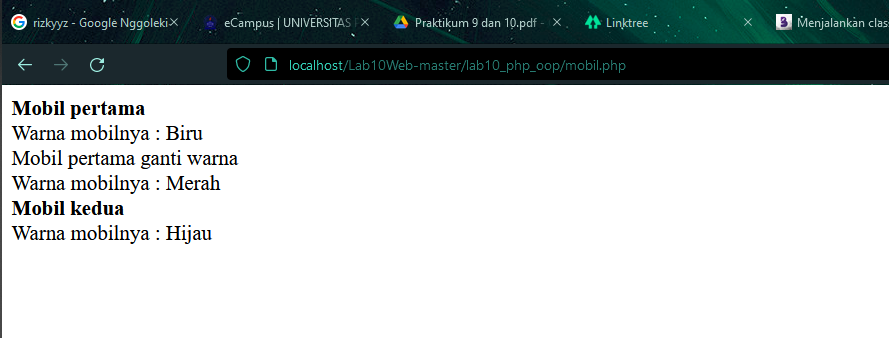

| 312010386         |   312010386       |
|-------------------|-------------------|
| TI.20.A.2         | PEMROGRAMAN WEB   |
| PERTEMUAN 11      | PRAKTIKUM 10      |

## PERTEMUAN 11

## Praktikum 10: PHP OOP
Dipertemuan kali ini kita akan mempelajari  **PHP OOP**

# Praktikum 10

1. Persiapkan text editor misalnya VSCode. 
2. Buat folder baru dengan nama lab10_php_oop pada docroot webserver (htdocs)
3. Ikuti langkah-langkah praktikum yang akan dijelaskan berikutnya. Langkah-langkah Praktikum

# Langkah - Langkah praktikum

1. buat file dengan pertama `mobil.php`
```
<?php
/**
* Program sederhana pendefinisian class dan pemanggilan class.
**/

class Mobil
{
    private $warna;
    private $merk;
    private $harga;

    public function __construct()
    {
        $this->warna = "Biru";
        $this->merk = "BMW";
        $this->harga = "10000000";
    }
    
    public function gantiWarna ($warnaBaru)
    {
        $this->warna = $warnaBaru;
    }

    public function tampilWarna ()
    {
        echo "Warna mobilnya : " . $this->warna; 
    }
}

// membuat objek mobil
$a = new Mobil();
$b = new Mobil();

// memanggil objek
echo "<b>Mobil pertama</b><br>";
$a->tampilWarna();
echo "<br>Mobil pertama ganti warna<br>";
$a->gantiWarna("Merah");
$a->tampilWarna();

// memanggil objek
echo "<br><b>Mobil kedua</b><br>";
$b->gantiWarna("Hijau");
$b->tampilWarna();

?>
```
*  Terlihat dari kode diatas kita telah memanggil satu objek yang sama namun dengan variable yang berbeda dimana kita akan coba merubah warna dari mobil tersebut, 


2. Buat file baru dengan nama `form.php`
```
<?php
/**
* Nama Class: Form
* Deskripsi: CLass untuk membuat form inputan text sederhan
**/
class Form
{
private $fields = array();
private $action;
private $submit = "Submit Form";
private $jumField = 0;
public function __construct($action, $submit)
{
$this->action = $action;
$this->submit = $submit;
}
public function displayForm()
{
echo "<form action='".$this->action."' method='POST'>";
echo '<table width="100%" border="0">';
for ($j=0; $j<count($this->fields); $j++) {
echo "<tr><td

align='right'>".$this->fields[$j]['label']."</td>";
echo "<td><input type='text'
name='".$this->fields[$j]['name']."'></td></tr>";
}
echo "<tr><td colspan='2'>";
echo "<input type='submit' value='".$this->submit."'></td></tr>";
echo "</table>";
}
public function addField($name, $label)
{
$this->fields [$this->jumField]['name'] = $name;
$this->fields [$this->jumField]['label'] = $label;
$this->jumField ++;
}
}
?>
```
* Class adalah prototype, atau blueprint, atau rancangan yang mendefinisikan variable dan method-methode pada seluruh objek tertentu. Class berfungsi untuk menampung isi dari program yang akan di jalankan, di dalamnya berisi atribut / type data dan method untuk menjalankan suatu program.

3. Buat file baru dengan nama `form_input.php`
```
<?php
/**
* Program memanfaatkan Program 10.2 untuk membuat form inputan sederhana.
**/
include "form.php";
echo "<html><head><title>Mahasiswa</title></head><body>";
$form = new Form("","Input Form");
$form->addField("txtnim", "Nim");
$form->addField("txtnama", "Nama");
$form->addField("txtalamat", "Alamat");
echo "<h3>Silahkan isi form berikut ini :</h3>";
$form->displayForm();
echo "</body></html>";
?>
```
* Fungsi PHP include() dan require() merupakan fungsi yang digunakan untuk menyertakan file php lain ke dalam suatu program PHP. Hal sangat yang sangat membantu proses pemrograman karena tidak perlu menulis program PHP secara berulang-ulang, cukup dalam satu file saja.

Laporan Praktikum
1. Buatlah repository baru dengan nama Lab10Web. 
2. Kerjakan semua latihan yang diberikan sesuai urutannya. 
3. Screenshot setiap perubahannya. 
4. Buatlah file README.md dan tuliskan penjelasan dari setiap langkah praktikum
beserta screenshotnya. 
5. Commit hasilnya pada repository masing-masing.